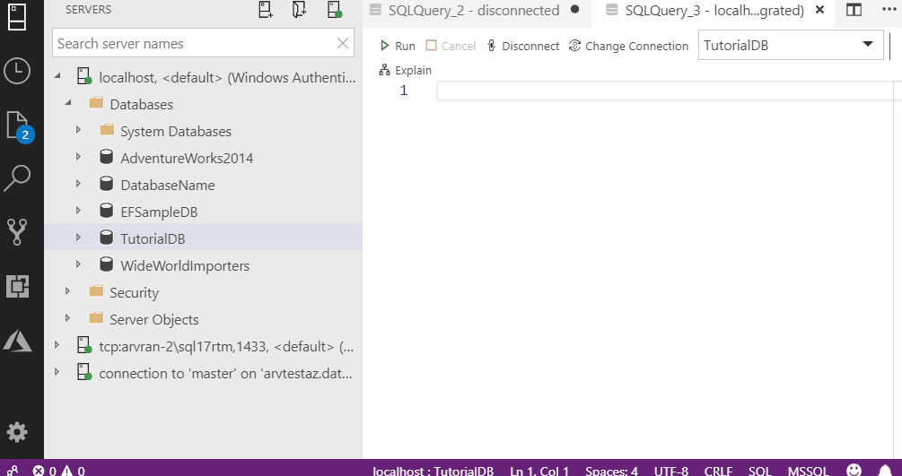
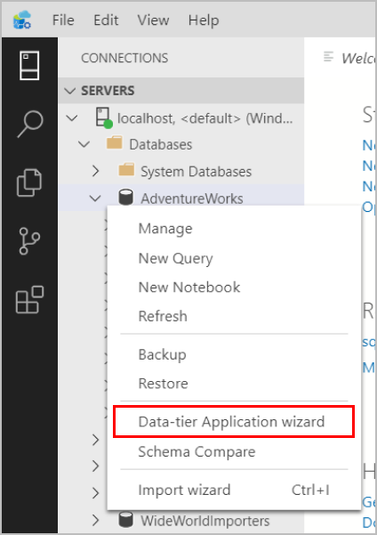

# SQL Server dacpac extension

**The Data-tier Application Wizard** provides an easy-to-use wizard experience to deploy and extract dacpac files and import and export bacpac files.

## Features

* Deploy a dacpac to a SQL Server instance
* Extract a SQL Server instance to a dacpac
* Create a database from a bacpac
* Export schema and data to a bacpac

## Why would I use the Data-tier Application Wizard?

The wizard makes it easier to manage dacpac and bacpac files, which simplifies the development and deployment of data-tier elements that support your application. To learn more about using Data-tier applications, [check out our documentation.](../../relational-databases/data-tier-applications/data-tier-applications.md)

## Install the extension

1. Select the Extensions Icon to view the available extensions.

    

2. Search for the **SQL Server dacpac** extension and select it to view its details. select **Install** to add the extension.

3. Once installed, **Reload** to enable the extension in Azure Data Studio (only required when installing an extension for the first time).

## Launch the Data-tier Application Wizard

To launch the wizard, right-click the Databases folder or right-click a specific database in the Object Explorer. Then, select **Data-tier Application Wizard**.

## Next steps

To learn more about dacpacs, [check out our documentation.](../../relational-databases/data-tier-applications/data-tier-applications.md)
Please report issues and feature requests [here.](https://github.com/microsoft/azuredatastudio/issues)